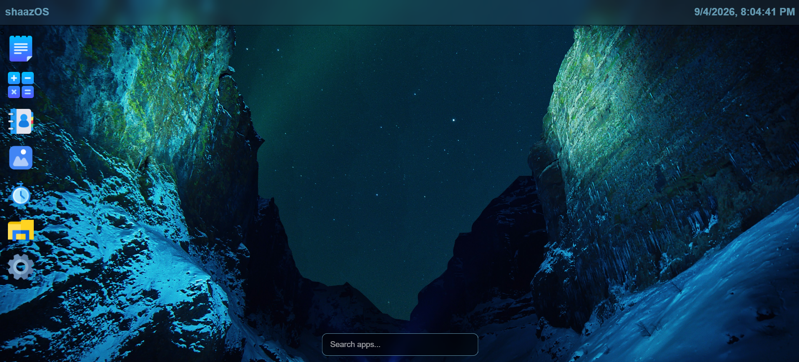
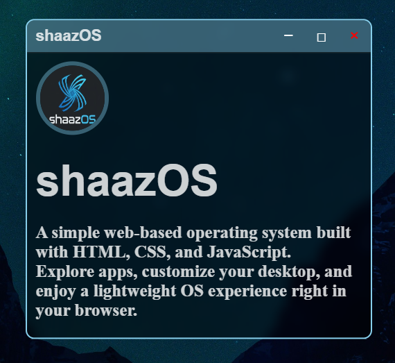
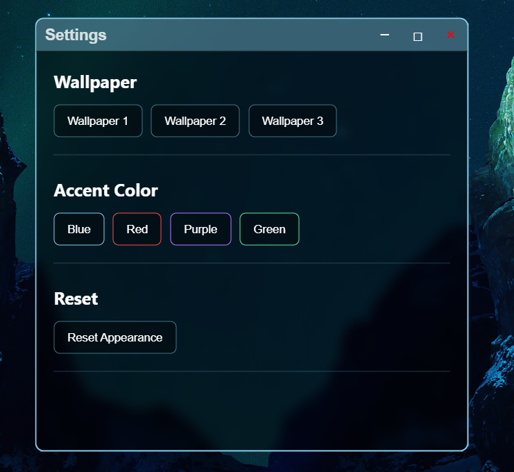
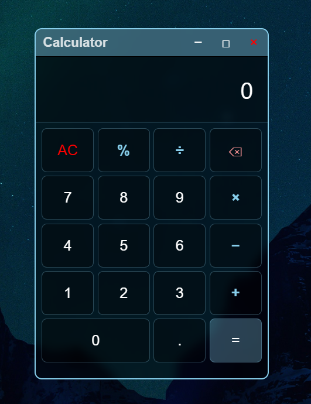
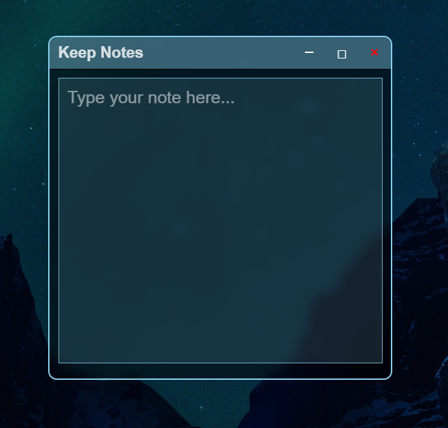
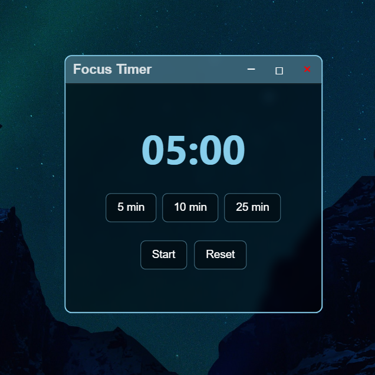

# shaazOS


A lightweight, web-based operating system built with **HTML, CSS, and JavaScript**.

shaazOS recreates a simple desktop environment directly in your browser, with interactive apps, customizable wallpapers, and an app search.

## Screenshots

### Desktop

 
### Welcome Screen


### Settings


### Calculator


### Keep Notes


### Focus Timer


## Features

* Desktop-style interface
* Interactive application windows
* Draggable windows
* Calculator
* Keep Notes
* Contact Me
* Gallery
* Focus Timer
* Settings
* Custom wallpapers
* App search
* Settings saved using Local Storage

## Built With

* HTML5
* CSS3
* JavaScript
* Local Storage

## Getting Started

Clone the repository:

```bash
git clone YOUR_REPOSITORY_URL
```

Open `index.html` in your browser.

No installation or build process is required.

## Customization

Use the **Settings** app to customize:

* Wallpaper
* Accent color
* Appearance

Your settings are stored locally in the browser.

## Goal

shaazOS is a personal project created to explore **web development, UI design, and JavaScript interactions** by building an operating-system-style environment that runs entirely in the browser.
